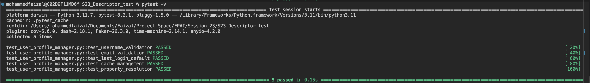

# User Profile Manager using Descriptors in Python

## Introduction

This assignment demonstrates the use of **property validation**, **weak references**, and **caching** in Python, all implemented within the `UserProfileManager` class. The assignment includes **validated properties** to ensure valid user data and utilizes a **weak reference dictionary** for efficient cache management. The provided test cases ensure that the functionality works as expected.

---

### Validated Property

A **Validated Property** is a custom descriptor class used to ensure that values assigned to specific attributes meet certain validation criteria. Descriptors in Python provide a powerful mechanism for controlling attribute access, and they are typically used to manage attribute behavior in classes.

- **`__get__`**: Retrieves the value of the attribute from the instance's dictionary.
- **`__set__`**: Checks the value before setting it to ensure it passes validation.
- **`__set_name__`**: Stores the attribute's name to reference it later in `__get__` and `__set__`.

**Example:**
```python
class ValidatedProperty:
    def __init__(self, validator):
        self.validator = validator
        self.name = None  # Name of the property

    def __set_name__(self, owner, name):
        self.name = name  # Store the attribute name

    def __get__(self, instance, owner):
        return instance.__dict__.get(self.name)  # Retrieve the value from instance dictionary

    def __set__(self, instance, value):
        if not self.validator(value):  # Validate the value before setting
            raise ValueError(f"Invalid value for {self.name}")
        instance.__dict__[self.name] = value  # Set the value if validation passes
```

- **Explanation**:
  - The `__set__` method acts as the setter for the attribute. It validates the value using the `validator` function before actually setting the attribute on the instance.
  - The `__get__` method retrieves the attribute value from the instance's `__dict__`, which is where all instance attributes are stored.
  - The `__set_name__` method allows the descriptor to know the name of the attribute it is managing, which is crucial for its functionality.

---

### Weak References and Caching

The assignment also demonstrates how **weak references** can be used for efficient cache management. Using **`WeakValueDictionary`** from the `weakref` module, you can store objects without preventing their garbage collection when there are no strong references to them. This helps in managing memory more efficiently, especially when caching objects that are not always needed.

**Example:**
```python
import weakref

class UserProfileManager:
    _cache = weakref.WeakValueDictionary()  # Cache using weak references

    @classmethod
    def add_to_cache(cls, manager):
        cls._cache[id(manager)] = manager  # Store the object by its id

    @classmethod
    def get_from_cache(cls, user_id):
        return cls._cache.get(user_id)  # Retrieve the object using its id
```

- **Explanation**:
  - The `WeakValueDictionary` stores weak references to objects, meaning that if no strong references to an object exist, it can be garbage collected. This helps avoid memory bloat in caching systems.
  - The `add_to_cache` method adds objects to the cache by their unique `id`, which acts as a key.
  - The `get_from_cache` method retrieves an object from the cache by using its `id`.

---

### Property Management

The `UserProfileManager` class manages two validated properties: `username` and `email`. The `username` must be a non-empty string, and the `email` must contain "@" and "." to ensure a valid email format. These validations are performed using the `ValidatedProperty` class.

**Example:**
```python
class UserProfileManager:
    username = ValidatedProperty(lambda x: isinstance(x, str) and len(x) > 0)
    email = ValidatedProperty(lambda x: "@" in x and "." in x)

    def __init__(self):
        self.last_login = None  # Default value for last_login
```

- **Explanation**:
  - The `username` property is validated using a lambda function that checks if the value is a non-empty string (`isinstance(x, str) and len(x) > 0`).
  - The `email` property is validated using a lambda function that checks if the value contains both "@" and "." (`"@" in x and "." in x`).
  - The `last_login` attribute is set to `None` by default, indicating that it has not been set yet.

Using validated properties ensures that only correct and well-formed data is assigned to these fields, providing a more robust and error-free system.

---

## Tests

Unit tests are written using `pytest` to ensure that the functionality works as expected. The tests cover:
- Validation of `username` and `email` properties.
- Default values for attributes like `last_login`.
- Correct behavior of the cache.
- Handling of weak references in the cache.

---

### Running Tests
To run the tests, execute the following command:

```bash
pytest -v
```

This will run the tests and display verbose output for each test case.

---

### Test Results



